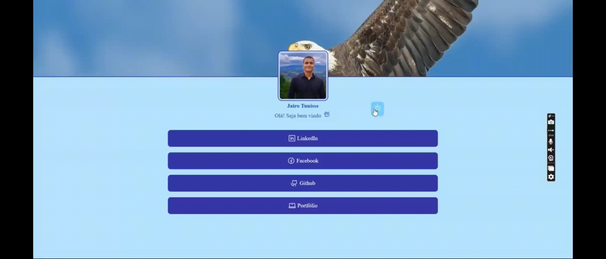

<h1 align="center">
  
</h1>

<p align="center">
 
</p>



## 💻 Project

My Personal linktree for show my social medias.

## :hammer_and_wrench: Features

- Change Dark and light theme. :heavy_check_mark:
- Add more links in the json. :heavy_check_mark:

## ✨ Technologies

- ReactJs :heavy_check_mark:
- Typescript :heavy_check_mark:
- Vector Icons :heavy_check_mark:
- ViteJs :heavy_check_mark:

## Executing the project

Use **yarn** or **npm install** to install project dependencies

```cl
 yarn dev
```

## 📄 License

This project is under license from MIT. See [LICENSE](LICENSE.md) for more details.
<br />

<div align="center"> 
  <small>Development with :blue_heart: by Jairo Tunisse - November/2021</small>

<br/>

[](https://www.instagram.com/jairotunisse)
[](https://www.linkedin.com/in/jairotsb/)
</div>
